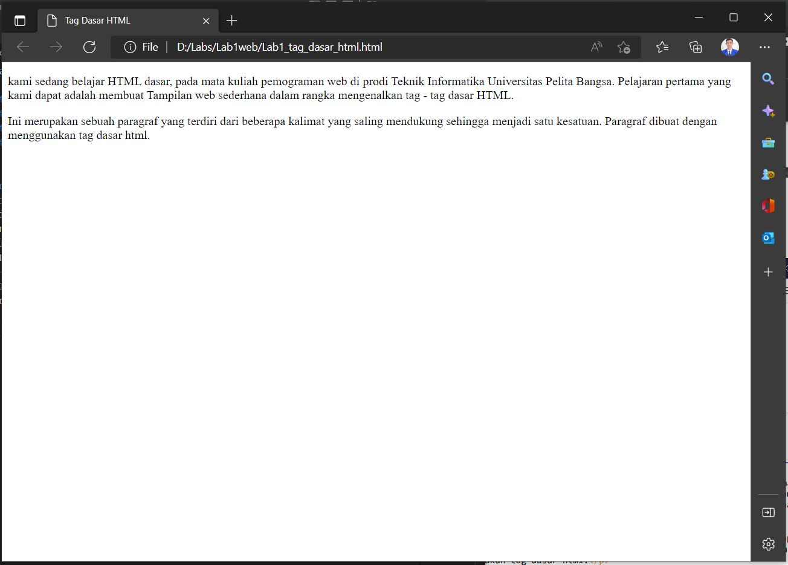
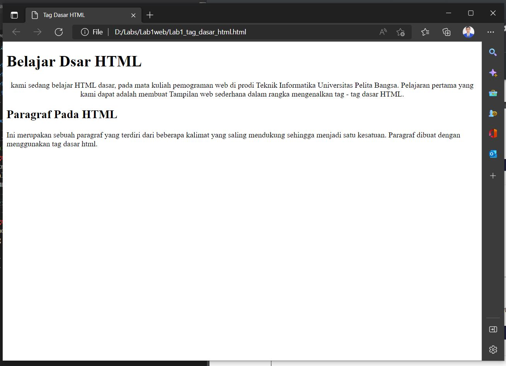
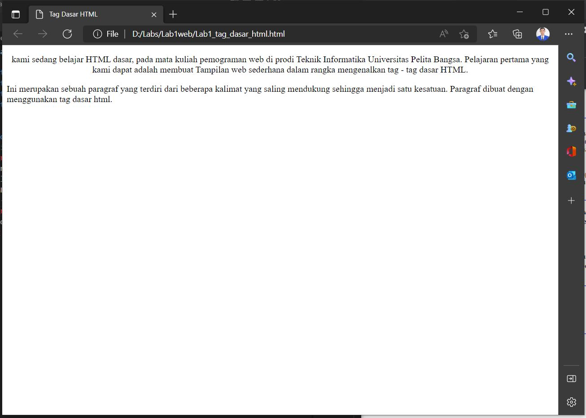
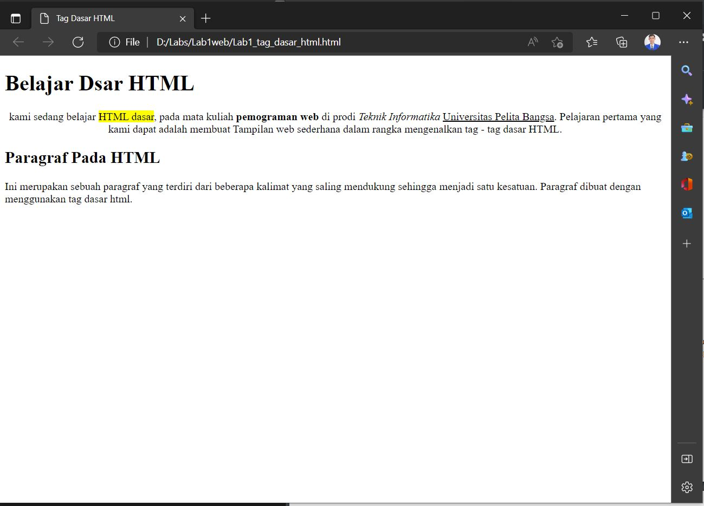
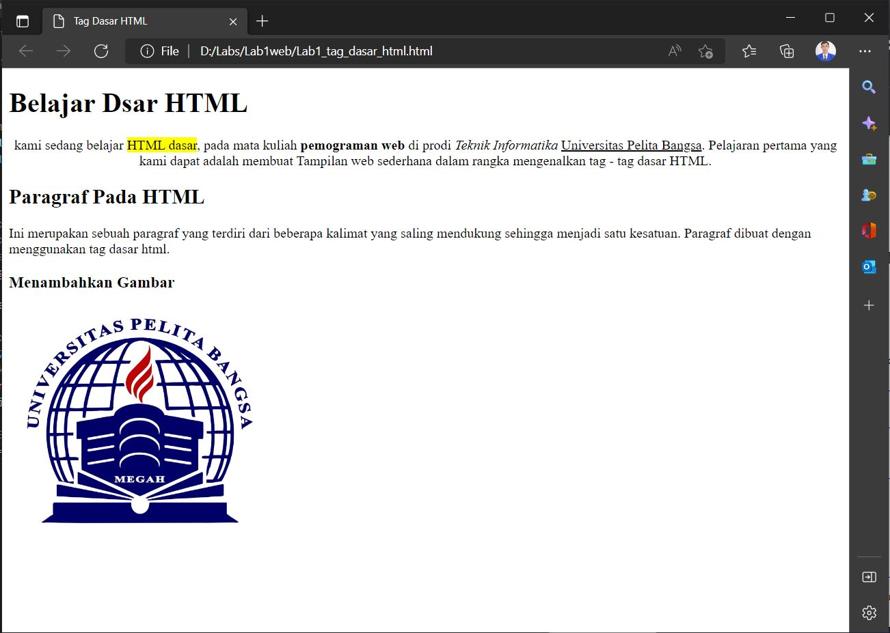
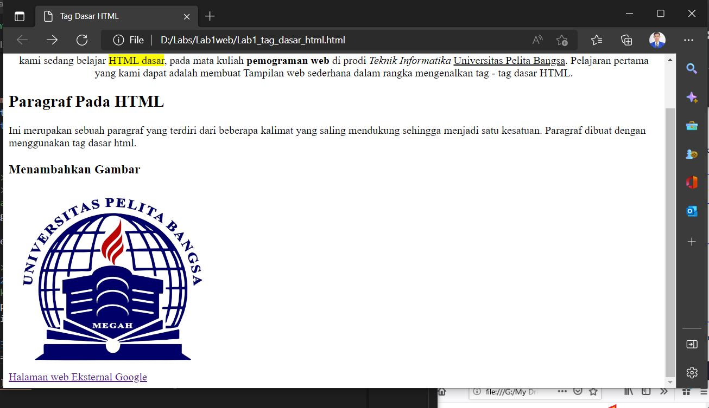

# Lab1web
## TUGAS PRAKTIKUM
## BELAJAR DASAR HTML

# TITLE BAR
unutuk memberi title pada web kita dapat menggunakan tag < title>
berikut adalah hasilnya
! [gambar 0](SCREEN/SS1.JPG)

# PARAGRAF
untuk menampilkan paragfar kita mengunakan tag < p >
berikut hasilnya

# MENAMBAHKAN JUDUL
untuk menambhakn judul pada paragraf menggunakan tag < h1 >
< h2 >
dan seterusnya.
berikut adalah hasilnya

# ATRIBUT PARAGAF
untuk mengatur atribut paragraf seperti:
rata tengah, rata kanan, rata kiri, rata kanan kiri
kita dapat melakukan < p align="center">
atau ( align="justify, left, right, dan center)
berikut adalah hasilnya

# MEMFORMAT TEKS
untuk melakukan format teks kita dapat menggunakan tag sebagai berikut:
< b> = untuk menebalkan hufur
< i> = untuk memiringkan huruf
< mark> = untuk memberi tanda pada huruf
dan lain sebagainya
berikut adalah hasilnya

# MENAMBAHKAN GAMBAR
untuk menambahkan gambar kita dapat menggunakan tag
< img src="nama file gambar" title="judul gambar(bebas")
berikut adalah hasilnya

# MENAMBAHKAN HYPERLINK

untuk menambahkan hyperlink kita dapat menggunakan tag sebagai berikut;
< nav>
    < a href="https://www.google.com">" halaman web eksternal google"< /a>
< /nav>
< hr>
berikut adalah hasilnya
